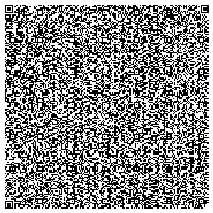

```
██████╗ ██╗██╗  ██╗███████╗██╗      ██████╗ ██████╗
██╔══██╗██║╚██╗██╔╝██╔════╝██║     ██╔═══██╗██╔══██╗
██████╔╝██║ ╚███╔╝ █████╗  ██║     ██║   ██║██████╔╝
██╔═══╝ ██║ ██╔██╗ ██╔══╝  ██║     ██║▄▄ ██║██╔══██╗
██║     ██║██╔╝ ██╗███████╗███████╗╚██████╔╝██║  ██║
╚═╝     ╚═╝╚═╝  ╚═╝╚══════╝╚══════╝ ╚══▀▀═╝ ╚═╝  ╚═╝
```

<div align="center">


[](https://saycheese.hackclub.com)
[-06140B?style=for-the-badge&labelColor=06140B&color=80F0A4)](https://github.com)
[](https://github.com)
[](https://github.com)
[-06140B?style=for-the-badge&labelColor=06140B&color=80F0A4)](https://github.com)
[-06140B?style=for-the-badge&labelColor=06140B&color=80F0A4)](https://github.com)

*An 8x8 Pixel Drawing Toy. Painted in HTML, Shipped as QR, Run in Scanner*

</div>

---

> *"The avg React -'Hello World' App is ≈ 130 kB.
> The Project file is minified down to 2,110 bytes."*

---

## ◈ What Is This
 
**PixelQR** - Interactive 8x8 Pixel-Art Canvas, lives entirely inside a QR Code.


Not *linked from* a QR code. Not *hosted somewhere* a QR code points to.  
**Inside the QR code.** The program IS the QR code. Scan it. The app opens. There is no server. There is no URL. There is no cloud. There is no `npm install`. There is only the void — and a glowing green grid.

---
 
## ◈ Built for [HackClub SayCheese](https://saycheese.hackclub.com) 🧀
 
> *"fit it in a QR code → profit???"*  — the SayCheese manifesto
 
SayCheese is a Hack Club initiative with a single, absurd, beautiful rule: **your entire program must fit inside a QR code.** No asterisks. No "the QR links to a CDN." The program. In the code. Scannable. Runnable. Real.

---


## ◈ Features (The Chaos Manifest)
 
### What It Does
 
- **Draw & Erase** — Click or drag across the 8×8 grid to toggle pixels green/dark
- **Symmetry Modes** — Cycle through `SYM → H → V → Q` for horizontal, vertical, and quad-radial mirroring
- **Invert** — Double-click the canvas, press `i`, or enter the Konami Code to flip all pixels
- **Transient by Design** — Zero persistence. No `localStorage`. No cookies. No sync. Your art lives for exactly as long as the tab is open. Impermanence is the point.
 
#### What It Deliberately Does Not Do
 
- ❌ Save your work
- ❌ Phone home to analytics
- ❌ Ask for notification permissions
- ❌ Have a loading spinner (it loads in 0ms)
- ❌ Require a login
- ❌ Have a cookie consent banner

---

 
</div>

```
  Raw HTML/CSS/JS
        │
        ▼
  ┌─────────────────────────────────────────────┐
  │  STAGE 1 — AUTHORING                        │
  │  Write the entire app in a single .html      │
  │  file. No imports. No external fonts.        │
  │  No <link> tags. No shame.                  │
  └─────────────────┬───────────────────────────┘
                    │
                    ▼
  ┌─────────────────────────────────────────────┐
  │  STAGE 2 — MINIFICATION                     │
  │  Strip whitespace, collapse CSS,            │
  │  inline everything. Kill your darlings.     │
  │  html-minifier-terser --minify-js           │
  │  --minify-css --collapse-whitespace         │
  └─────────────────┬───────────────────────────┘
                    │
                    ▼
  ┌─────────────────────────────────────────────┐
  │  STAGE 3 — BASE64 ENCODING                  │
  │  base64 -w 0 app.html > payload.b64         │
  │  Prepend: data:text/html;base64,            │
  │  Result: a self-contained Data URI.         │
  │  2,110 bytes of HTML → 2,846-char URI.      │
  └─────────────────┬───────────────────────────┘
                    │
                    ▼
  ┌─────────────────────────────────────────────┐
  │  STAGE 4 — QR MATRIX GENERATION             │
  │  Encode the Data URI as QR Version 40.      │
  │  ECC Level L (7% recovery).                 │
  │  177×177 modules. Black on white.           │
  │  Export as PNG. That PNG IS the app.        │
  └─────────────────┬───────────────────────────┘
                    │
                    ▼
             📱 Phone Camera
                    │
                    ▼
         data:text/html;base64,...
                    │
                    ▼
            Browser interprets
                    │
                    ▼
        ✦ App runs. No server pinged. ✦
```

<div align="center">

<p align="center">
  
</p>
 
```
> SYSTEM: pixelqr.exe
> STATUS: running
> MEMORY: 2110 bytes
> DEPENDENCIES: 0
> UPTIME: until you close the tab
> _
```
 
*Made with monospace fonts, pointer events, and a deep suspicion of npm.*
 
[](https://saycheese.hackclub.com)
 
</div>